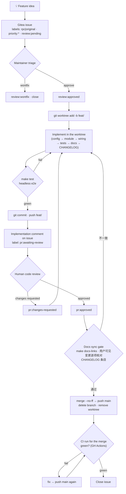

# Developing & testing pi.nvim

Operational playbook for taking a feature from idea to merged code. `AGENTS.md` is the architecture charter; this skill is authoritative for **workflow and testing**. Depth lives in `references/` — this file is the index.

## Feature lifecycle



### Phase rules

| Phase | Key rules |
|-------|-----------|
| Issue | Body is the spec — never overwrite it. Implementation notes go in **comments**. Labels: type (`rpc`/`original`), priority, review gate. |
| Branch | Create a **git worktree** on `feat/<short-kebab-name>` and develop there — never in the live `lazy/pi2.nvim` checkout. Baseline `make test` green before starting. |
| Implement | Follow the **standard places** checklist below. Config knobs touch **three** spots in `config.lua` (G19). |
| Test | Cheapest layer that can observe the behavior. State what was verified and what was not, and end the final report's verification section with a copy-pasteable manual-test nvim command (`PI_DEV_DIR` gate for worktree code — references/testing.md § Verification discipline). |
| PR | Push branch → implementation comment → `pr:awaiting-review`. CI runs on the push; confirm the run is green before review. |
| Review | `pr:changes-requested` → fix → re-push → back to `pr:awaiting-review`. `pr:approved` → merge. |
| Docs gate | Merge 前必须通过 **docs sync gate**：`make docs-links` 绿；逐项核对用户可见变更（commands / keymaps / config / highlight groups / public API / documented behavior）已在**同一变更**里同步到 `README.md` 与 `doc/*.md`；`CHANGELOG.md` 有当日条目。不一致 → 回到 Implement 补齐后重新走 review。详见下方 "Docs sync gate (before merge)"。 |
| Merge | In the **main checkout**: `git merge --no-ff`, push main, delete remote+local branch, `git worktree remove`. **Verify the CI run for the merge commit is green** (see CI verification below), then close issue. |

Gitea: 所有交互统一使用 `tea` CLI（eos-bootstrap 安装，login `yuez`），**不要**手写 curl 调 API。issue 生命周期命令速查见 `references/gitea.md`。

## Worktree workflow

Develop every feature in its own **git worktree**, never in the main checkout: `~/.local/share/nvim/lazy/pi2.nvim` is a *live lazy.nvim plugin path* the running editor loads, so it must stay on `main` — branching there swaps the running editor's code and races with concurrent sessions.

```bash
MAIN=~/.local/share/nvim/lazy/pi2.nvim; WT_ROOT=~/.local/share/pi.nvim-worktrees; name=<short-kebab>
git -C "$MAIN" worktree add "$WT_ROOT/$name" -b "feat/$name" origin/main   # keep OUTSIDE .../nvim/lazy
```

In a worktree, `make test` and headless e2e under `-u tests/minimal_init.lua` exercise **the worktree**, but `make smoke`/GUI load the **main checkout** (G23). Remove the worktree only after review is approved and merged. Full setup/verification/cleanup commands: `references/worktree.md`.

## Verification layers

| Layer | Command | Sees | Cannot see |
|-------|---------|------|------------|
| Unit (plenary) | `make test` | pure-Lua logic, config resolution | buffers, windows, keys, rendering |
| Headless e2e | `make smoke` / `nvim --headless -l script.lua` | plugin load, RPC, buffer/extmark wiring | visual rendering, real key events |
| GUI automation | `scripts/gui_launch.sh` + `gui_harness.sh` (macOS: `scripts/macos/`) | real keybindings, insert mode, **pixels** | — (top layer, slow) |
| CI gate | `.github/workflows/lint.yml` (auto on push/PR) | `make style` + `make lint` reproducibility on a clean runner | plugin runtime; mirrors style/lint only, not `make test` |

Details, pitfalls, isolation recipe, and script usage: `references/testing.md`.

## CI verification

A feature is **not complete until the CI run for its merge commit is green** — local green ≠ CI green (the runner is a different, clean environment). `.github/workflows/lint.yml` runs `make style` + `make lint` on every push to `main` and on PRs; it is self-contained (downloads stylua + lua-language-server, no Neovim needed). `make test` is **not** in CI yet — keep running it locally.

- The repo is public, so run status is readable without auth:
  `curl -s "https://api.github.com/repos/zgs225/pi2.nvim/actions/runs?branch=main&per_page=5"` (or `gh run list` when logged in).
- Inspect a run's jobs/steps: `.../actions/runs/<run_id>/jobs` (or `gh run view <run_id>`).
- The workflow has no `workflow_dispatch`; it triggers on push/PR. To trigger it, push a commit. Manual dispatch needs auth (`gh auth login` or a PAT with `actions:write`).
- On failure, fix on a branch, push, and re-check the new run before (re-)merging.

## Standard places a new feature lands

- **Config knob** → `lua/pi/config.lua` — three spots: `---@class` annotation, `pi.Options` field, `defaults` table (G19).
- **Pure logic** → `lua/pi/<name>.lua`, one table returned, `_` prefix for private, `_reset()` for testability.
- **Public API** → `lua/pi/init.lua`, nil-guard on `Sessions.get()`.
- **Chat wiring** → `lua/pi/ui/chat/init.lua`: keymaps in `_set_keymaps()`, submit logic in `_send_message()`.
- **History rendering** → `lua/pi/ui/chat/history.lua`; tool renderers → `lua/pi/ui/chat/tools.lua`.
- **Highlight group** → `lua/pi/ui/highlights.lua` (`default = true`).
- **Checkable requirements (deps / version floors / config)** → `lua/pi/health.lua` + `lua/pi/compat.lua`: 新特性若引入用户可诊断的依赖、版本下限或配置要求，必须同步给 `:checkhealth pi` 新增检查项（ok/error/warn 三态），并在 `doc/troubleshooting.md` 描述该检查项。版本常量集中放在 `compat.lua`（如 vision fallback 的 `vision_min_supported = "0.81.0"`，与 `min_supported`/`validated` 同处），不要在 health.lua 里硬编码。参考实例：vision fallback 的 pi 0.81.0+ 版本下限检查（`feat(health): check pi version floor for vision fallback`）。
- **Docs (README + `doc/`) + CHANGELOG** → docs-code consistency is mandatory: user-facing changes update `README.md` / the relevant `doc/*.md` in the same commit; internal changes still verify the docs remain accurate and fix any drift. Run `make docs-links` before committing.
- **Tests** → `tests/<name>_spec.lua`; e2e per `references/testing.md`.

## Docs sync gate (before merge)

Merge 前对文档做一次显式核对（流程图 M2，Phase rule `Docs gate`）——不要只依赖实现阶段的自觉，文档与代码必须始终同源（AGENTS.md）：

1. `make docs-links` —— 相对链接与锚点有效（提交前也要跑）。
2. 逐项核对本次变更的用户可见面，确认已在同一变更里更新文档：
   - `:Pi*` commands → `doc/usage.md`（命令表）
   - keymaps → `doc/keymaps.md`
   - config keys → `doc/configuration.md`（config.lua 三处，G19）
   - highlight groups → `doc/highlight-groups.md`
   - checkhealth 新增/变化的检查项 → `doc/troubleshooting.md`（同 commit 更新；如 vision fallback 的 pi 0.81.0+ 下限检查）
   - public API（`pi.*`）→ `doc/api.md`
   - 行为/默认值变化 → `README.md` 与对应特性的 `doc/*.md`
3. 用户可见变更必须有 `CHANGELOG.md` 当日条目（`date +%F`）。
4. 漂移快扫：`git diff --stat <base>..HEAD -- doc README.md CHANGELOG.md` —— 用户可见变更却没有 doc/CHANGELOG diff 是红旗；用变更关键词在 `doc/` 里 grep 旧措辞。

## Gotchas

G1–G30 are indexed in the quick-reference table at the top of `references/gotchas.md`, with full 现象/根因/修法 and minimal reproductions below it. Read the full entry before relying on a one-liner. Most frequent traps: G1/G2/G3 (expr-mapping keys), G4/G5 (headless e2e), G6 (visual needs a GUI screenshot), G14 (spec scoping), G19 (three config spots), G21 (restart nvim after editing `lua/pi/**`), G23 (worktree test layers), G24 (LuaJIT-parseable syntax).

## Cross-references

- `references/worktree.md` — why worktrees, exact setup/verification/cleanup commands, layer caveats.
- `references/architecture.md` — module map, hard design constraints, rationale for standard places.
- `references/testing.md` — layer details, pitfalls, isolation recipe, verification discipline, script usage.
- `references/gotchas.md` — quick-reference table + full 现象/根因/修法 for G1–G30 with minimal reproductions.
- `references/gitea.md` — tea CLI cheat sheet for the issue lifecycle (create/list/labels/comments/close).
- `AGENTS.md` — architecture charter, style, type-annotation conventions.
- `.agents/skills/commit/SKILL.md` — Conventional Commit format, CHANGELOG rules, breaking-change policy.
